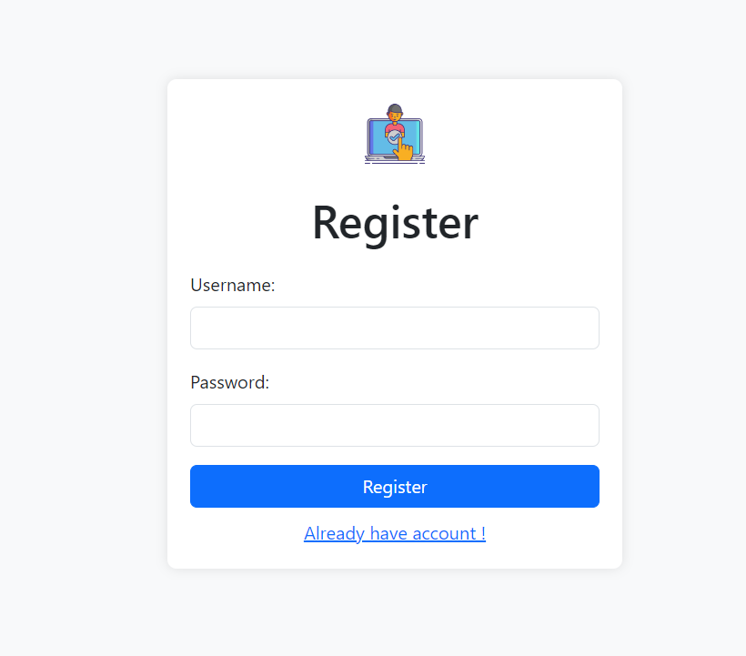

# Event Management Application

This event management application allows users to manage events efficiently. Users can register, log in, create new events, update existing events, delete events, and search for events based on titles and dates. The application follows the MVC (Model-View-Controller) pattern to ensure separation of concerns and improve maintainability.

## Table of Contents

- [Project Overview](#project-overview)
- [Installation Instructions](#installation-instructions)
- [Usage Guide](#usage-guide)
  - [User Registration](#user-registration)
  - [User Login](#user-login)
  - [Event Management](#event-management)
  - [Views](#views)
  - [Styles](#styles)
- [Configuration](#configuration)
  - [Middleware](#middleware)
  - [Models](#models)
- [Contributing Guidelines](#contributing-guidelines)
- [License](#license)

## Project Overview

This event management application allows users to manage events efficiently. Users can register, log in, create new events, update existing events, delete events, and search for events based on titles and dates. The application follows the MVC (Model-View-Controller) pattern to ensure separation of concerns and improve maintainability.

## Installation Instructions

1. **Clone the repository**:
    ```bash
    git clone (https://github.com/GyanjuRaoi/EventManagement.git)
    cd your-repo
    ```

2. **Install dependencies**:
    ```bash
    npm install
    ```

3. **Set up environment variables**:
    Create a `.env` file in the root directory and add the following:
    ```
    PORT=3000
    SECRET_KEY=your_secret_key
    NODE_ENV=development
    ```

4. **Run the application**:
    ```bash
    npm start
    ```

## Usage Guide

### User Registration

To register a new user, navigate to `/register` and fill out the registration form.

### User Login

To log in, navigate to `/login` and enter your credentials.

### Event Management

- **View Events**: Navigate to `/` to view all events.
- **Create Event**: Navigate to `/new` to create a new event.
- **Update Event**: Navigate to `/update/:id` to update an event.
- **Delete Event**: Use the delete button on an event to remove it.
- **Search Event by Title**: Navigate to `/search?title=your_title` to search for an event by title.
- **Filter Events by Date**: Navigate to `/filter?startDate=YYYY-MM-DD&endDate=YYYY-MM-DD` to filter events by date range.

#### Views

- **Error Page (`error.ejs`)**: This page displays error messages to users when they encounter errors during application use.
- **Event Form Page (`eventForm.ejs`)**: This page allows users to create or update events. It includes forms for entering event details such as title, description, participants, start date, and end date.
- **Event List Page (`eventList.ejs`)**: This page displays a list of events. Users can view event details, including title, description, participants, start date, and end date. If a user is logged in and they are the creator of an event, they have the option to update or delete the event.

#### Styles

The application uses Bootstrap for styling, along with custom CSS files (`eventlist.css` and `navBar.css`) to enhance the user interface.

## Configuration

### Middleware

- **Error Handling Middleware**: Handles 404 and 500 errors and displays appropriate error messages to users.
- **JWT Middleware**: Validates JWT tokens for user authentication and authorization.

### Models

- **Event Model**: Manages event data, including fetching, creating, updating, and deleting events.
- **User Model**: Manages user data, including fetching and creating users.

## Contributing Guidelines

Contributions are welcome! Please fork the repository and create a pull request with your changes.

## License

This project is licensed under the [ISC License](LICENSE).

Screenshot

Landing page / Event List


Login 


Register


404 Not found


Intertnal Server error

